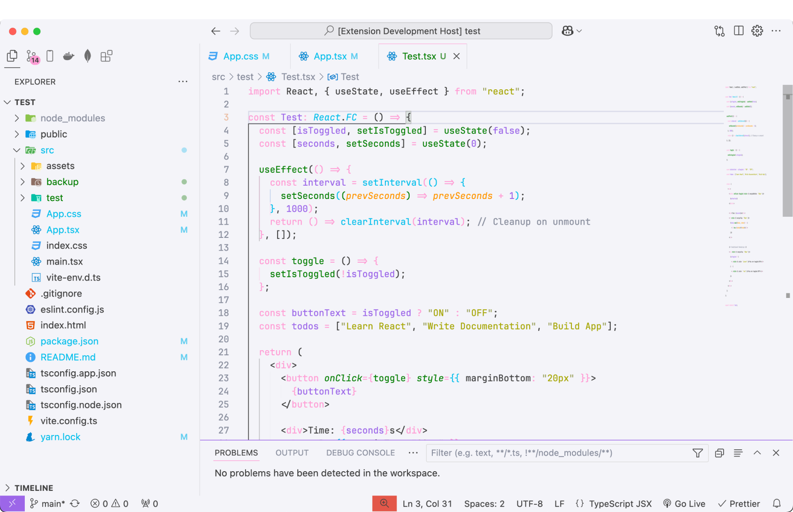
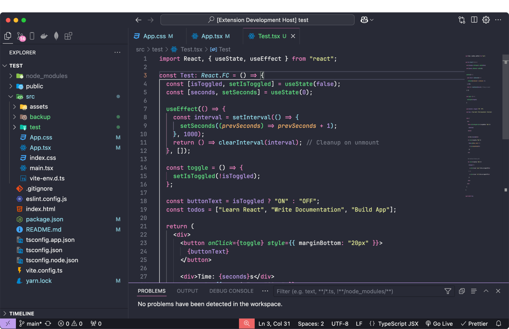

# Dracula Theme Light & Dark

A light and dark theme inspired by the popular Dracula theme.

## Features

- 🧛 **Dracula Light:** A soft, vibrant light theme for daytime coding.
- 🌘 **Dracula Dark:** The classic dark theme with personalised enhancements.

## Screenshots

### Dracula Light

### Dracula Dark

## Installation

1. Open **Extensions View** (`Ctrl+Shift+X` or `Cmd+Shift+X`).
2. Search for `"Dracula Theme Light & Dark"`.
3. Click **Install** and select your desired theme:
   - Dracula Light
   - Dracula Dark

## Usage

1. Go to **File > Preferences > Color Theme** (or `Ctrl+K Ctrl+T`).
2. Select `Dracula Light` or `Dracula Dark` from the list.

## Contributing

If you'd like to contribute or report issues, please visit the [GitHub repository](https://github.com/f-hossen/dracula-theme-light-dark).

## Credits

This theme is inspired by the popular [**Dracula**](https://draculatheme.com/) theme, with adjustments and customisations to fit my vision for a versatile and visually comfortable development experience.

## License

[MIT License](LICENSE)
